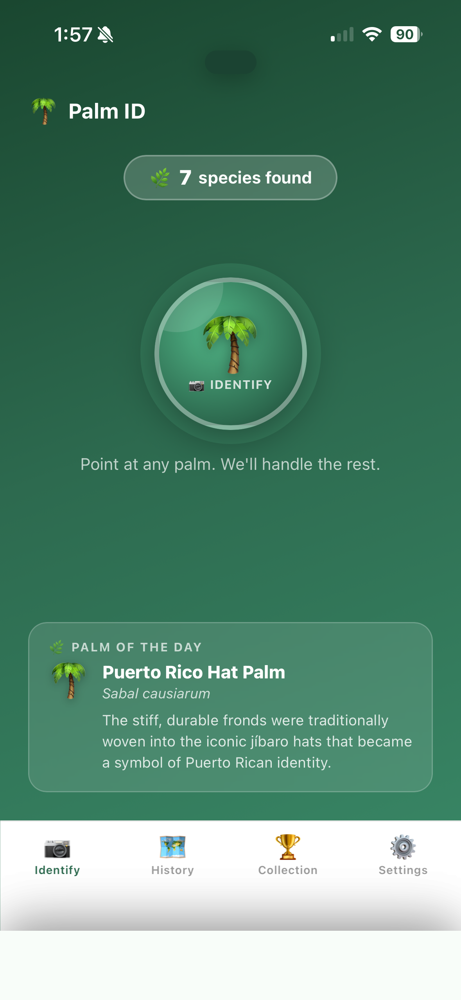
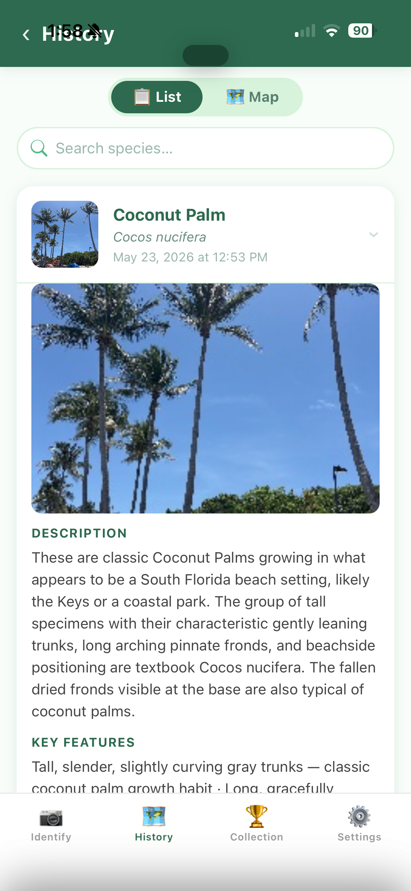
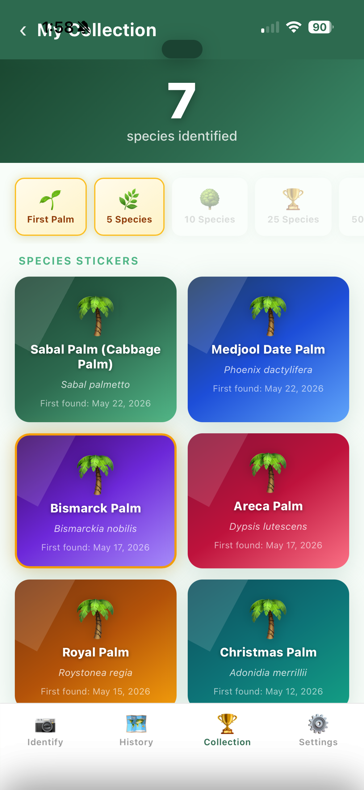
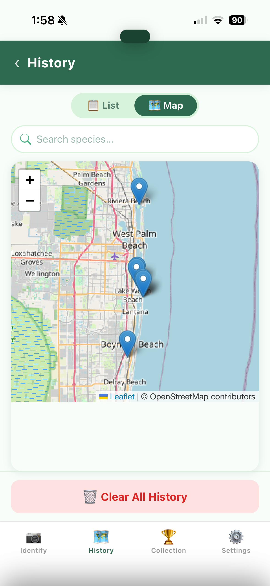

# 🌴 Palm ID

A progressive web app that identifies palm trees from photos using Claude. Point your phone at a palm, tap Identify, and get the species name, distinguishing features, and native range in a few seconds. No app store, no account — install it straight from the browser.

**[▶ Try it live](https://willyvolk.github.io/palm-id/)** — runs entirely in your browser. You'll need your own [Anthropic API key](https://console.anthropic.com) to run an identification (it's stored only on your device).

## What it does

- **Identifies palms from 1–3 photos** using Claude vision, with a confidence level and the field mark that confirms the call
- **Names the look-alike to rule out** — for each ID it tells you the most similar species and exactly how to tell them apart
- **Remembers every sighting** with a thumbnail, GPS location, and your notes, stored on-device
- **Maps your sightings** on an interactive map so you can see where you found what
- **Builds a collection with a field guide** — tracks how many of ~30 palms you've discovered (a "12 / 30" progress grid), and assigns each find a rarity (common / uncommon / rare) worth points, so spotting an Old Man Palm feels like a score, not a log entry
- **Answers follow-up questions** about any identified palm in a short chat
- **Installs like an app** and loads instantly offline (it's a PWA), with no server, account, or backend

## Screenshots

<table>
  <tr>
    <td align="center" width="25%"><br><sub><b>Point and identify</b></sub></td>
    <td align="center" width="25%"><br><sub><b>Species, with the why</b></sub></td>
    <td align="center" width="25%"><br><sub><b>A collection you build</b></sub></td>
    <td align="center" width="25%"><br><sub><b>Every sighting, mapped</b></sub></td>
  </tr>
</table>

## Why I built it

South Florida has hundreds of palm species in the wild and in landscaping, and I kept misidentifying them. The commonly confused pairs are genuinely tricky — Bottle Palm vs Spindle Palm look nearly identical until you learn to read the trunk shape. I wanted something I could pull out mid-walk that would tell me not just the name but *why* it's that species and not the similar one next to it.

The existing plant-ID apps are general-purpose. They'll tell you it's a palm. I wanted something that knew the difference between a Roystonea regia and a Veitchia joannis, or why a Sabal palmetto and a Washingtonian might look the same from a distance. The system prompt here is the whole product: it encodes the confusion pairs and regional context that make identifications actually reliable.

## How it works

```
Camera / photo library  →  Claude Vision  →  Structured result  →  History + map
  (up to 3 photos per        (base64 image      (species, features,    (GPS coords,
   identification)            + expert prompt)    confidence, notes)     exportable)
```

1. **Capture photos.** Take 1–3 photos of the palm. More angles improve accuracy — if the trunk and the fronds are hard to see in one shot, add a second.
2. **Send to Claude.** Photos are resized client-side (1024px max) and sent as base64 image blocks in a single API call. No server involved — the call goes directly from your browser to `api.anthropic.com`.
3. **Parse the result.** Claude returns structured JSON: common name, scientific name, confidence level, key identifying features, native range, and the most similar species to rule out.
4. **Save to history.** Each identification is stored in `localStorage` with the thumbnail, GPS coordinates (if permitted), and any notes you add. The history screen lets you search and filter past sightings.

## The design decision I'm happiest with

The system prompt knows about confused species pairs by region.

A generic "identify this plant" prompt will often get the genus right and the species wrong. Royal Palm and Sunshine Palm both have a green crownshaft and ringed gray trunk — the difference is trunk bulge and height, and you have to know to look. Bottle Palm and Spindle Palm are the single most confused pair in South Florida landscaping; the trunk shape is the entire tell.

So instead of asking Claude to identify any plant from first principles, the prompt pre-loads the confusion pairs for South Florida, California, and the Caribbean. It names the distinguishing feature for each pair. When the model sees a swollen-trunked palm, it already knows to look for whether the bulge is at the base (Bottle) or the middle (Spindle).

Adding a new region is one edit: drop the relevant pairs and distinguishing features into the `SYSTEM_PROMPT` constant near the top of `index.html`.

## Sample output

Here's a real result for a Spindle Palm photographed in a Miami parking lot.

```
SPINDLE PALM
Hyophorbe verschaffeltii

CONFIDENCE
High

KEY FEATURES VISIBLE
Trunk shape is the definitive tell: widest in the middle with even 
tapering toward both top and bottom — a symmetrical spindle or 
football shape. Compare to the Bottle Palm (H. lagenicaulis), which 
is widest near the base and tapers sharply upward like an inverted 
teardrop. Smooth green crownshaft, compact crown of arching pinnate 
fronds.

NATIVE RANGE
Rodrigues Island (Mascarene Islands), Indian Ocean. Now ubiquitous in 
South Florida and tropical landscaping worldwide.

MOST SIMILAR SPECIES
Bottle Palm (Hyophorbe lagenicaulis) — same genus, same size class, 
same crownshaft. Trunk shape is the only reliable field mark. Bottle 
Palm is broadest at the base; Spindle Palm is broadest in the middle.

ADDITIONAL NOTES
Both Hyophorbe species are critically endangered in the wild. The 
specimens you see in Florida parking lots outnumber the wild 
population of their home islands.
```

## Running it yourself

Everything runs in the browser — there's no server, no database, no build step. You need one thing: an [Anthropic API key](https://console.anthropic.com).

**Option 1 — GitHub Pages (recommended, free)**

1. Fork this repo
2. Go to **Settings → Pages → Source: Deploy from branch → main → / (root)**
3. Your app is live at `https://yourusername.github.io/palm-id/`
4. Open it on your phone, tap the share icon, and choose **Add to Home Screen**

**Option 2 — Netlify (also free, slightly faster deploys)**

1. Fork this repo
2. Go to [netlify.com](https://netlify.com), connect GitHub, and select the repo
3. Deploy settings: no build command, publish directory is `/`
4. Done — Netlify gives you a URL you can install as a PWA

**Option 3 — Run locally**

```bash
git clone https://github.com/WillyVolk/palm-id.git
cd palm-id
# Any static server works
python3 -m http.server 8080
# then open http://localhost:8080
```

> Service workers require HTTPS (or localhost). For local testing, `localhost` works fine. If you deploy to a custom domain, make sure it's HTTPS or the PWA install and offline features won't work.

On first launch, the app will prompt you for your Anthropic API key. It's stored in `localStorage` — it never leaves your device except as the bearer token on calls to `api.anthropic.com`.

## Customizing it

**Change the region.** The system prompt in `index.html` has detailed confusion pairs for South Florida, California, and the Caribbean. If you're building for a different region — Southeast Asia, Australia, the Canary Islands — replace or extend the regional sections with the species and confusion pairs relevant to you.

**Change the model.** The model is set in one constant:
```js
const API_MODEL = 'claude-opus-4-6';
```
Swap it for `claude-sonnet-4-6` if you want faster, cheaper calls and are willing to trade some accuracy on the harder confusion pairs.

**Change the subject entirely.** The architecture is just "photo → Claude vision → structured result → history." The system prompt and the result parser are the only palm-specific parts. Point it at succulents, mushrooms, birds, or whatever you keep misidentifying on walks.

## Known limits

- **Juveniles and heavily pruned specimens** are harder to identify — a young Queen Palm and a young Coconut Palm with no fruit look very similar. Adding a second photo from a different angle helps.
- **Indoor/potted palms** photographed without scale context are occasionally misidentified because trunk height and proportion are important field marks.
- **History is local only.** Sightings are stored in `localStorage`. Deleting the PWA from your home screen wipes the history. Export your sightings from the History screen before uninstalling. Your API key can be copied from Settings before you delete.
- **Large photos are handled** — images are resized to 1024px client-side before the API call, so even a 48MP phone photo fits in a single request.

## Files

```
index.html      The entire app — HTML, CSS, and JS in one file
sw.js           Service worker — caches the app shell for offline/fast load
manifest.json   PWA manifest — icons, display mode, theme color
icon-192.png    App icon (192×192)
icon-512.png    App icon (512×512)
```

## Built with

HTML · CSS · JavaScript · Claude (Anthropic) · Web Share API · Geolocation API
